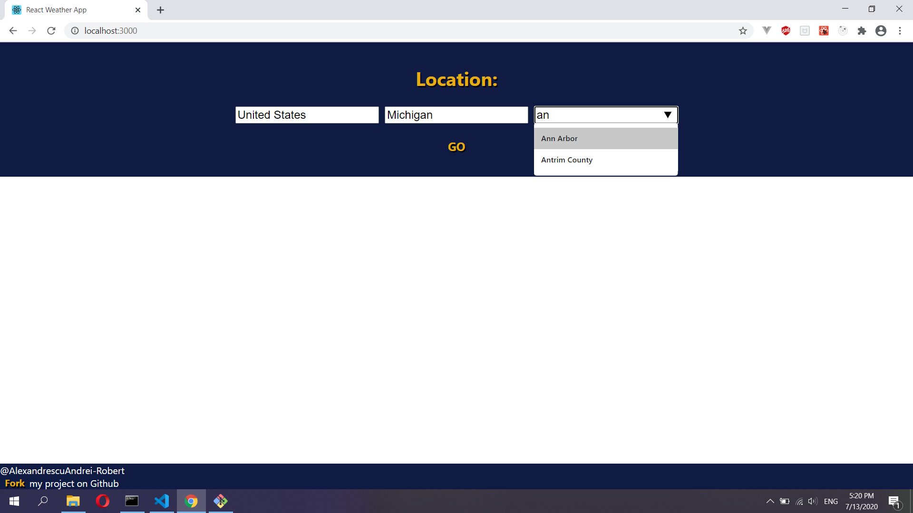
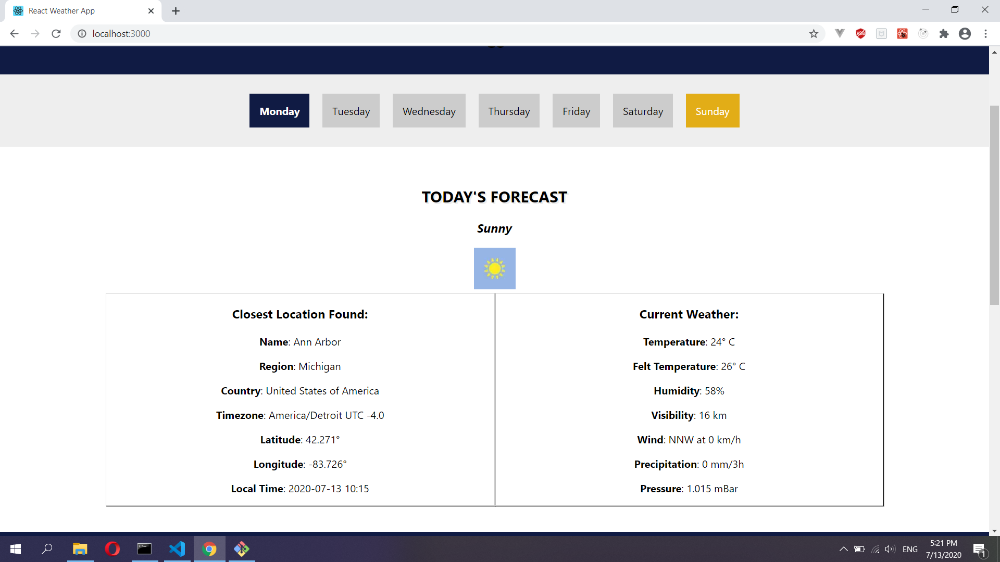
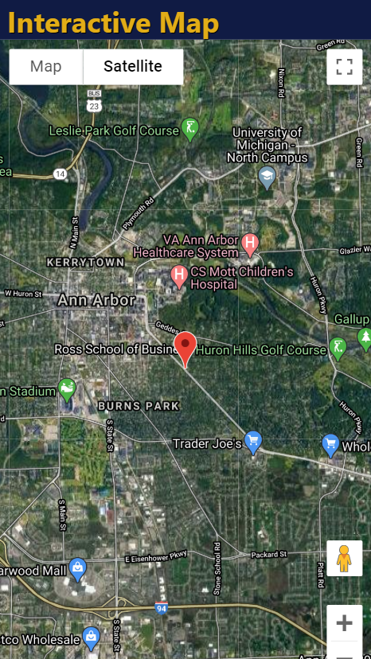

<h1>React Weather Web App</h1>

<h3>Functionalities so far:</h3>
<ul>
  <li>Search for your country/region/city</li>
  <li>Retrieve data related to your location</li>
  <li>See the location on the map</li>
  <li>Recieve the forecast for the whole week</li>
</ul>

<h3>Non-functional requirements:</h3>
<ul>
  <li>mobile friendly</li>
  <li>error validation</li>
</ul>

<h2>Screenshots</h2>

Cities db taken from: https://github.com/dr5hn/countries-states-cities-database

Weather API used: https://weatherstack.com/

Maps taken from: Google Maps Platform

